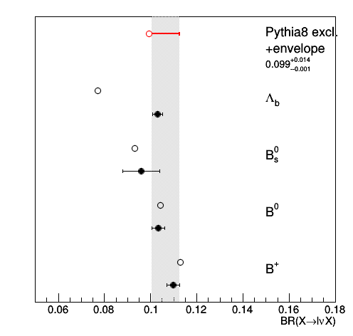

# Introduction

# Installation

This module is expected to run for 94X CMSSW versions and higher.
It depends on the ParticleLevelProducer that is contained in CMSSW >= 9_4_10.
For older releases and older weights, use alternate branches.

To produce B semileptonic decay uncertainties, use of CMSSW >= 10_6_19_patch2 is required.
For older releases, only the b fragmentation weights can be computed.

```
cmsrel CMSSW_10_6_19_patch2
cd CMSSW_10_6_19_patch2/src 
cmsenv
mkdir TopQuarkAnalysis
cd TopQuarkAnalysis
git clone https://gitlab.cern.ch/CMS-TOPPAG/BFragmentationAnalyzer.git
cd -
scram b
```

# Description 

Two plugins are available:
* `BFragmentationAnalyzer`: allows to create some simple histograms
with the b-fragmentation momentum transfer functions (and the number of semi-leptonically decaying B hadrons)
in the simulation. That module is used to derive the fragmentation weights.
* `BFragmentationWeightProducer`: puts in the EDM event ValueMaps with weights 
to be used on a jet-by-jet case to reweight the fragmentation function and the semi-leptonic 
branching ratios of the B hadrons according to the uncertainties

# Running the plugins

The analyzer can be run on the output of the ParticleLevelProducer.
The example below generates, some Pohweg TT events, showers them with Pythia8 setting a specific tune and Bowler-Lund parameter,
and produces histograms with the distributions of xb and other quantities.
```
cmsRun test/runBFragmentationAnalyzer_cfg.py frag=BL param=0.855 tune=CP5 maxEvents=1000 outputFile=xb_default.root
```
The producer can also be run on the output of the ParticleLevelProducer.
The example below shows how to do it starting from a MiniAOD file.
```
cmsRun test/runBFragmentationWeightProducer_cfg.py
```
In your analysis you can use the per-jet weights either by accessing the results of the producer in your analyzer
or by replicating the producer code which basically opens a ROOT file with weights and evaluates them
depending on the xb variable of a b-jet or if it contains or not a semi-leptonic decay.
The event weight to apply to evaluate the effect should be the product of the weights for all jets in the event.
For the first case an example is provided below.

**Important note**: the variable xb is computed using genJets with neutrinos clustered inside the jets,
which differs from what is usually done. If you already have genJets available (e.g. from running the ParticleLevelProducer) for your analysis,
or using GenJets in NanoAOD, you have to make sure to re-run the ParticleLevelProducer with the correct settings.

## Accessing the weights in a EDM analyzer

Step-by-step instructions to readout one of the weights in your analyzer.

1. declare the tokens to access genJets and weights in your class
```
   edm::EDGetTokenT<std::vector<reco::GenJet> > genJetsToken_;
   edm::EDGetTokenT<edm::ValueMap<float> > fragToken_;
```
2. in the constructor declare what the tokens consume
```
   genJetsToken_(consumes<std::vector<reco::GenJet> >(edm::InputTag("particleLevel:jets"))),
   fragToken_(consumes<edm::ValueMap<float> >(edm::InputTag("bfragWgtProducer:fragCP5BLVsPt"))),
```
3. in the analyzer method get the genJets, the weights and **loop over the jets** to analyse them, and **take the product of the jet weights as event weight**
```
  edm::Handle<std::vector<reco::GenJet> > genJets;
  iEvent.getByToken(genJetsToken_, genJets);
  edm::Handle<edm::ValueMap<float> > frag;
  iEvent.getByToken(fragToken_, frag);
  double weight = 1.;
  for (auto genJet=genJets->begin(); genJet!=genJets->end(); ++genJet) {
    edm::Ref<std::vector<reco::GenJet> > genJetRef(genJets, genJet-genJets->begin());
    weight *= (*frag)[genJetRef];
	cout << "pt=" << genJet->pt() << " id=" << genJet->pdgId() << " fragWeight=" << (*frag)[genJetRef] << endl;
	...
  }
```
4. Add the particleLevel and weight producer snippets to your cfg
```
    process.load('SimGeneral.HepPDTESSource.pythiapdt_cfi')
    process.mergedGenParticles = cms.EDProducer("MergedGenParticleProducer",
						inputPruned = cms.InputTag("prunedGenParticles"),
        				inputPacked = cms.InputTag("packedGenParticles"),
    )
    from GeneratorInterface.RivetInterface.genParticles2HepMC_cfi import genParticles2HepMC
    process.genParticles2HepMC = genParticles2HepMC.clone(genParticles = cms.InputTag("mergedGenParticles"))
    process.load("GeneratorInterface.RivetInterface.particleLevel_cfi")
    process.particleLevel.excludeNeutrinosFromJetClustering = False
    process.load('TopQuarkAnalysis.BFragmentationAnalyzer.bfragWgtProducer_cfi')
    ...
    process.p = cms.Path(process.mergedGenParticles*process.genParticles2HepMC*process.particleLevel*process.bfragWgtProducer*...)
```
You should be ready to go! Other weights follow the same scheme.

## Available weights

The weights have been computed to reweight the default fragmenation scenario in Pythia8 with the CP5 tune, to these various scenarios
(these are the name of the weights as produced by the `BFragmentationWeightProducer`):

* `fragCP5BL`: CP5, Bowler-Lund, tuned to LEP + up/down uncertainties
* `fragCP5BLdown`
* `fragCP5BLup`
* `fragCP5Peterson`: CP5, Peterson, tuned to LEP + up/down uncertainties
* `fragCP5Petersondown`
* `fragCP5Petersonup`
* `fragCUETP8M2T4BL`: CUETP8M2T4, Bowler-Lund, tuned to LEP (assuming Monash)
* `fragCUETP8M2T4BLdefault`: CUETP8M2T4, Bowler-Lund, Pythia8 default
* `fragCUETP8M2T4BLLHC`: CUETP8M2T4, Bowler-Lund, TOP-18-012 result + up/down uncertainties
* `fragCUETP8M2T4BLLHCdown`
* `fragCUETP8M2T4BLLHCup`

All these weights are obtained using an "averaged" analysis that doesn't take into account the dependence on the jet pt.
pt-dependent weights are also available, which result in somewhat reduced adverse effects on the normalization and kinematics from
the reweighting: just append `VsPt` to the names above to access those.

The fragmenation weights are based on the tuning to LEP/SLD data described in https://gitlab.cern.ch/cms-gen/Tuning/merge_requests/20,
as well as the results from TOP-18-012.

B hadron semileptonic branching ratio uncertainty weights are named `semilepbrup` and `semilepbrdown`. No pt-dependent weights
are necessary (or available) for those.
They are based on the comparison between the PDG values (http://pdglive.lbl.gov/Viewer.action) 
and the Pythia8 decay tables (http://home.thep.lu.se/~torbjorn/pythia82html/ParticleData.html).
The information is summarized below for the exclusive decay modes (no taus accounted for).

| Particle      | Pythia8       | PDG            |
| ------------- | ------------- | -------------- |
| B+-           | 0.1129        | 0.1099+-0.0028 |
| B0            | 0.1043        | 0.1033+-0.0028 |
| B0s           | 0.093         | 0.0960+-0.008  |
| Lambdab       | 0.077         | 0.1090+-0.0022 | 

The figure below summarizes this table and shows the inclusive BR obtained directly from Pythia8
and the envelope assigned to cover the uncertainties and differences in the BRs.
(The figure can be generated with `python test/drawBrs.py`).



The envelopes derived from the figure above are used to re-scale the inclusive branching ratios
(taus included) and derive the weights to apply to semi-leptonically or non-semi-leptonically
decaying B hadrons.

# Expert notes

To create the weights file one needs to run the  `BFragmentationAnalyzer` on the different fragmentation 
scenarios needed to estimate the fragmentation systematics.

To submit all of these on condor (on lxplus), run:
```
cd test
./condor_submit.sh condor_output condor.sub
```
When the jobs are finished, merge the files and put the resulting files in a separate folder:
```
./merge_outputs.sh condor_output
mkdir results; mv condor_output/*.root results/
```
This will output several ROOT files, one per scenario which can be used to obtain the ratio with respect to the nominal scenario
used in the official CMSSW productions. Next, the fragmentation and decay weights can be computed from the different scenarios
(this includes a smoothing of the weight functions) and the results moved to the `data` folder:
```
./buildWeightFile.py -i results -o results
./buildBRweights.py -i results -o results
cp results/b*weights*.root ../data/
```
The pt-averaged weights file contains TGraph objects which can be used to reweight the fragmentation function based on xb=pT(B)/pT(b jet),
the pt-dependent weight file contains two-dimensional histograms which can be used to reweight the fragmentation function
taking into account the observed dependence on genJet pt,
and the B decay file contains a TGraph to reweight the inclusive semi-leptonic branching ratios of the B hadrons for different hadron types (PDGids).

Note that the B decay weights are simply computed from the PDG and Pythia branching ratio, and do not use the output of the `BFragmentationAnalyzer`.
The `buildBRweights.py` however also checks that the procedure used to "tag" the semileptonic B hadron decays properly recovers the values
hardcoded in Pythia, based on those results.

The smoothing procedure is observed to slightly bias the overall normalization (average value) of the weights. To (partially) correct this,
a second condor job can be launched that will only generate the nominal scenario but apply all the previously obtained weights (which should be placed
in the `data` folder as described above).
From the resulting histograms, the normalization effect can be measured and removed:
```
./condor_submit.sh condor_fixNorm condor_fixNorm.sub
```
Then, run
```
./merge_output.sh condor_fixNorm
mkdir results_fixNorm
./fixWeightNormalization.py -i results -d condor_normWeights/xb_CP5BLdefault.root -o results_fixNorm/
cp results_fixNorm/b*weights*.root ../data/
```

Validation plots can be produced using:
```
mkdir plots_fixNorm
./plotResults.py  -i results_fixNorm -o plots_fixNorm
```
