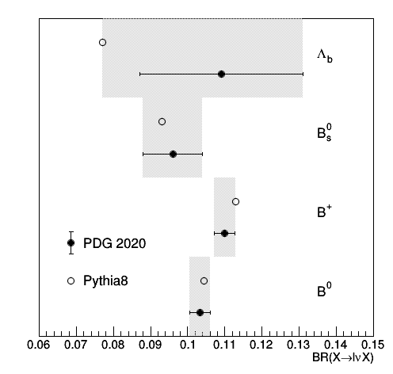

# Introduction

# Installation
This module is expected to run for CMSSW versions >94X.
It depends on the ParticleLevelProducer that is contained in CMSSW >=9_4_10.
For older releases, use the master branch.

```
cmsrel CMSSW_9_4_10
cd CMSSW_9_4_10/src 
cmsenv
mkdir TopQuarkAnalysis
cd TopQuarkAnalysis
git clone https://gitlab.cern.ch/CMS-TOPPAG/BFragmentationAnalyzer.git -b master_94x
cd -
scram b
```

# Description 
Two plugins are available:
* `BFragmentationAnalyzer`: allows to create some simple histograms
with the b-fragmentation momentum transfer functions and the number of semi-leptonically decaying B hadrons
in the simulation
* `BFragmentationWeightProducer`: puts in the EDM event ValueMaps with weights 
to be used on a jet-by-jet case to reweight the fragmentation function and the semi-leptonic 
branching ratios of the B hadrons according to the uncertainties

# Running the plugins
The analyzer can be run on the output of the ParticleLevelProducer.
The example below produces some Pohweg TT events and showers them with Pythia8 setting a specific tune and Bowler-Lund parameter.
```
cmsRun test/runBFragmentationAnalyzer_cfg.py frag=BL param=0.855 tune=CP5 outputFile=xb_central.root
```
The producer can also be run on the output of the ParticleLevelProducer.
The example below shows how to do it starting from a MiniAOD file.
```
cmsRun test/runBFragmentationWeightProducer_cfg.py
```
In your analysis you can use the per-jet weights either by accessing the results of the producer in your analyzer
either by replicating the producer code which basically opens a ROOT file with weights and evaluates them
depending on the xb variable of a b-jet or if it contains or not a semi-leptonic decay.
For the first case an example is provided below.

## Accessing the weights in a EDM analyzer

Step-by-step instructions to readout one of the weights in your analyzer.

1. declare the tokens to access genJets and weights in your class
```
   edm::EDGetTokenT<std::vector<reco::GenJet>  > genJetsToken_;
   edm::EDGetTokenT<edm::ValueMap<float> > petersonFragToken_;
```
2. in the constructor declare what the tokens consume
```
   genJetsToken_(consumes<std::vector<reco::GenJet> >(edm::InputTag("particleLevel:jets"))),
   fragToken_(consumes<edm::ValueMap<float> >(edm::InputTag("bfragWgtProducer:fragCP5BL"))),
```
3. in the analyzer method get the genJets, the weights and **loop over the jets** to analyse them, and **take the product of the jet weights as event weight**
```
  edm::Handle<std::vector<reco::GenJet> > genJets;
  iEvent.getByToken(genJetsToken_,genJets);
  edm::Handle<edm::ValueMap<float> > frag;
  iEvent.getByToken(fragToken_, frag);
  for(auto genJet=genJets->begin(); genJet!=genJets->end(); ++genJet)
    {
        edm::Ref<std::vector<reco::GenJet> > genJetRef(genJets,genJet-genJets->begin());
	cout << "pt=" << genJet->pt() << " id=" << genJet->pdgId() << " fragWeight=" << (*frag)[genJetRef] << endl;
	...
    }
```
4. Add the particleLevel and weight producer snippets to your cfg
```
    process.load('SimGeneral.HepPDTESSource.pythiapdt_cfi')
    process.mergedGenParticles = cms.EDProducer("MergedGenParticleProducer",
						inputPruned = cms.InputTag("prunedGenParticles"),
        					inputPacked = cms.InputTag("packedGenParticles"),
    )
    from GeneratorInterface.RivetInterface.genParticles2HepMC_cfi import genParticles2HepMC
    process.genParticles2HepMC = genParticles2HepMC.clone( genParticles = cms.InputTag("mergedGenParticles") )
    process.load("GeneratorInterface.RivetInterface.particleLevel_cfi")
    process.particleLevel.excludeNeutrinosFromJetClustering = False
    process.load('TopQuarkAnalysis.BFragmentationAnalyzer.bfragWgtProducer_cfi')
    ...
    process.p = cms.Path(process.mergedGenParticles*process.genParticles2HepMC*process.particleLevel*process.bfragWgtProducer*...)
```
You should be ready to go! Other weights follow the same scheme.


# Expert notes

To create the weights file one needs to run the  `BFragmentationAnalyzer` on the different fragmentation 
scenarios needed to estimate the fragmentation/semi-leptonic BR systematics.

To submit all of these on condor (on lxplus), run:
```
cd test
./condor_submit.sh condor
```
When the jobs are finished, merge the files and put them in a "results" folder:
```
./merge_outputs.sh condor
mkdir results; mv condor/*.root results/
```
This will output several ROOT files, one per scenario which can be used to obtain the ratio with respect to the nominal scenario
used in the official CMSSW productions. Next, the weights can be computed from the different scenarios and the results moved to the `data` folder:
```
./buildWeightFile.py -i results -o results
./buildBRweights.py -i results -o results
mv results/b*weights*.root ../data/
```
The weights file will TGraph objects which can be used to reweight the fragmentation function based on xb=pT(B)/pT(b jet),
two-dimensional histograms which can be used to reweight the fragmentation function taking into account the obserbed dependence with genJet pt,
and the inclusive semi-leptonic branching ratios of the B hadrons. 
The first are based on the tuning to LEP/SLD data described in https://gitlab.cern.ch/cms-gen/Tuning/merge_requests/2,
as well as the results from TOP-18-012.
The latter is based on the comparison between the PDG values (http://pdglive.lbl.gov/Viewer.action) 
and the Pythia8 decay tables (http://home.thep.lu.se/~torbjorn/pythia82html/ParticleData.html).
The information is summarized below for the exclusive decay modes (no taus accounted for).

| Particle      | Pythia8       | PDG            |
| ------------- | ------------- | -------------- |
| B+            | 0.1129        | 0.1099+-0.0028 |
| B0            | 0.10429       | 0.1033+-0.0028 |
| B0s           | 0.093         | 0.0960+-0.008  |
| Lambdab       | 0.077         | 0.1030+-0.0022 | 

The figure below summarizes this table and shows the inclusive BR obtained directly from Pythia8
and the envelope assigned to cover the uncertainties and differences in the BRs.
(The figure can be generated with `python test/drawBrs.py`).



The envelopes derived from the figure above are used to re-scale the inclusive branching ratios
(taus included) and derive the weights to apply to semi-leptonically or non-semi-leptonically
decaying b hadrons.
